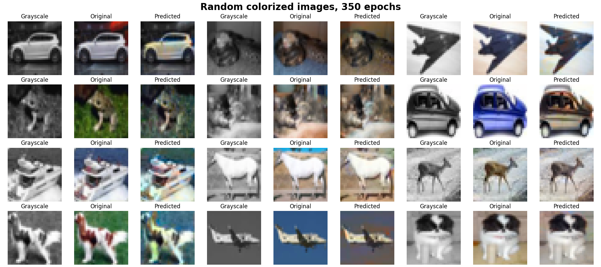

# 🧞‍♂️🎅🦹‍♂️RLGAN-project-MAADM-UPM 👽🤖👹
Neuroevolution to learn the Lunar Lander from Gymnasium and a GAN to learn to color images. Subject from the ML and BD master´s degree of UPM.

# 🧙‍♂️ Create ".venv_torch"
You need correct CUDA, CUDA Toolkit and cudNN versions installed according to your GPU. Used here:

* Python 3.10 version
* Pytorch 2.5 version

If installing with "requirements_torch.txt" there´s an error with torch:
1. Install everything except "torch", torchaudio" and "torchvision" (comment them):
   
    ```pip3 install -r requirements_torch.txt```

2. Verify installing specific gymnasium dependencies:

    ```pip3 install gymnasium[box2d] gymnasium[other]``` 

3. Install torch with CUDA (e.g CUDA 11.8): 

   ```pip3 install torch torchvision torchaudio --index-url https://download.pytorch.org/whl/cu118```
   
# 🧛‍♂️ Create ".venv_tensorflow"
You need correct CUDA, CUDA Toolkit and cudNN versions installed according to your GPU. Used here (from an Anaconda environment):

* Python 3.10 version
* Tensorflow 2.9 version 

# 📓 Notebook *RLGAN-p1-AG.ipynb*
Notebook for the first practical task, the lunar lander with reinforcement learning using a genetic algorithm.
The chromosomes are a MLP (class in file *MLP.py*) total weights and biases converted to lists. The Genetic Algorithm
process is in the file *AGLunarLander.py*.

# 📓 Notebook *RLGAN-p1-DQN.ipynb*
Notebook as a variant of the previous solution using a DQN in Pytorch.

# 📓 Rest of notebooks *RLGAN-p1*
* *RLGAN-p1-PPO.ipynb*: Variation of the Lunar Lander done with a PPO (**P**roximal **P**olicy **O**ptimization) agent from stable-baselines3 library.
* *RLGAN-p1-FB-AG.ipynb*: Playing Flappy Bird game with the same genetic algorithm mechanic.
* *RLGAN-p1-FB-PPO.ipynb*: Variation of the Flappy Bird game done with the PPO agent from stable-baselines3.

# 📓 Notebook *RLGAN-p2-GAN.ipynb*
Training a GAN to color images from CIFAR10 dataset.

# 📓 Notebook *RLGAN-p2-DCGAN.ipynb*
Training a DCGAN to generate digits from MNIST dataset.

# 📓 Notebook *RLGAN-p2-WGANGP.ipynb*
Training a WGANGP to generate digits from MNIST dataset.

# 📂 Folder "results_p1"
Results of solutions for Lunar Lander and Falppy Bird, including:

* 📈 Reward histories and test videos from all models.
* 🤖 *.txt* files: Models from the GA versions with the best global chromosome and the best last chromosome.
* 🤖 *lunar_lander_DQN.pt* file: Model from the MLP version with the weights and optimizer states.
* 🤖 *.zip* files: Saves from the PPO models in both versions.

⭐ **NOTE:** Each notebook shows how to load it´s model to test it directly without training. ⭐

# 📂 Folder "results_p2"
Results for the 3 different GANs and their tasks:

* **GAN** files: Losses, specific and random predictions.
* **DCGAN** files: Losses, GIF results, image results and a modal collapse example.
* **WGANGP** files: Losses and results.  

# 🎮 Previews 
<p align="center"><b>Lunar Lander with GA</b></p>
<p align="center"></p>

<p align="center"><b>Lunar Lander with DQN</b></p>
<p align="center"></p>

<p align="center"><b>Lunar Lander with PPO</b></p>
<p align="center"></p>

<p align="center"><b>Flappy Bird with GA</b></p>
<p align="center"></p>

<p align="center"><b>Flappy Bird with PPO</b></p>
<p align="center"></p>

<!--------------------------------------------------------------------->

<p align="center"> <b>GAN</b> image predictions</p>
<p align="center"></p>

<p align="center"> <b>GAN</b> random image predictions</p>
<p align="center"></p>

<p align="center"> <b>DCGAN</b> results </p>
<p align="center"></p>

<p align="center"> <b>DCGAN</b> modal collapse </p>
<p align="center"></p>

<p align="center"> <b>WGANGP</b> results </p>
<p align="center"></p>

# ⚖️ License
From Lunar Lander to colonizing Mars (SpaceX hire us).

From GAN colorization to paint better than Picasso (We wish).

# 👥 Authors

* Alejandro Mendoza [@pintamonas4575](https://github.com/pintamonas4575)
* Jaime Álvarez     [@JaimeAlvarez434](https://github.com/JaimeAlvarez434)
* Álvaro Fraile     [@alvarofraile](https://github.com/alvarofraile)


